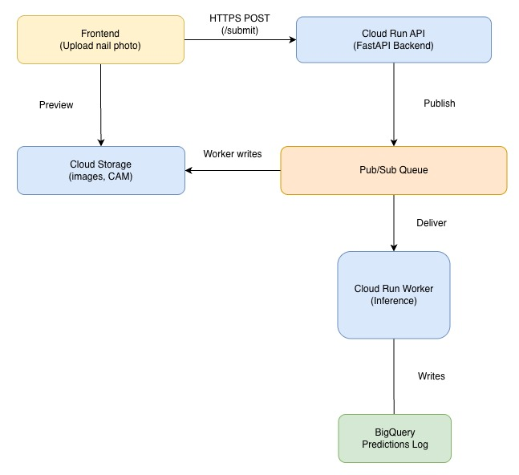
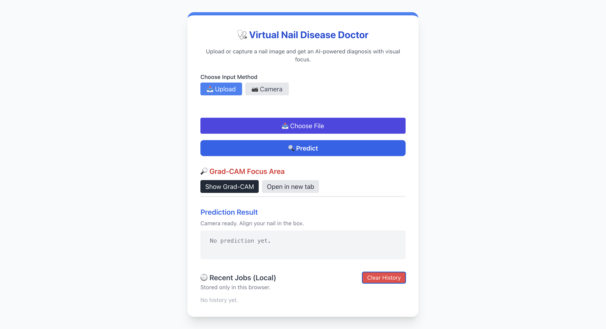
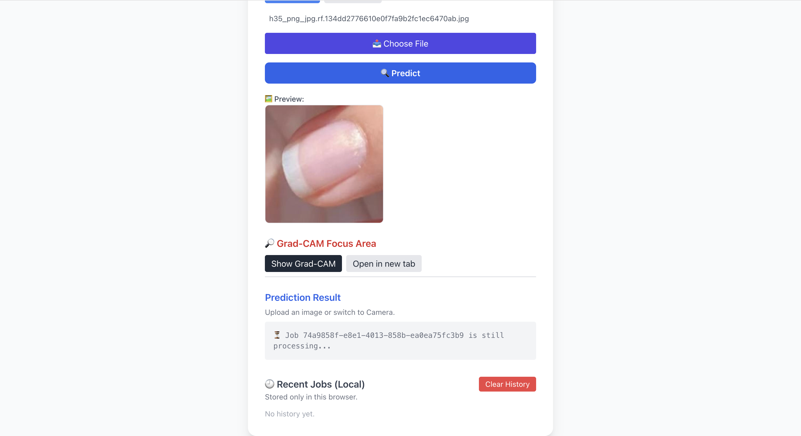
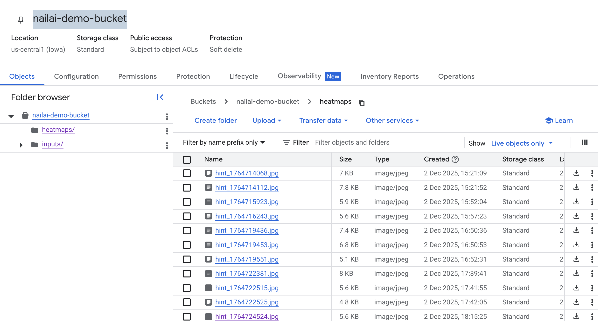
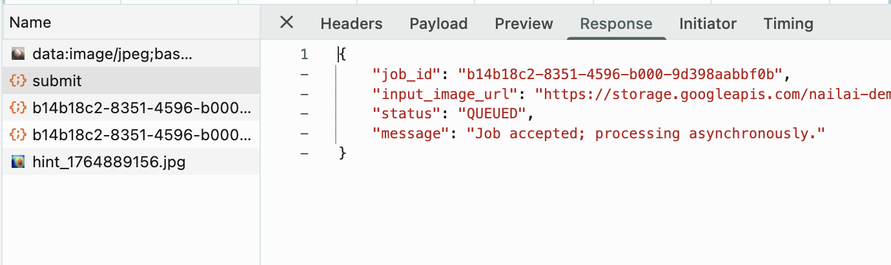
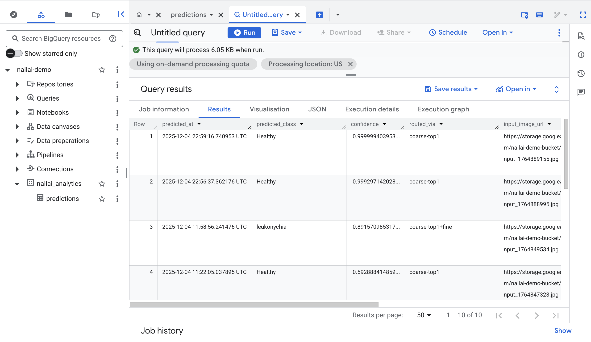
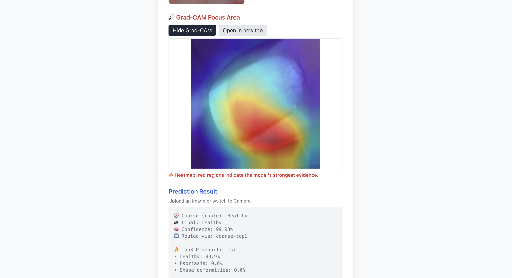

# NailAI: Cloud-Powered Fine-Grained Nail Disease Detection System 🩺

NailAI is a fully serverless, production-ready medical AI pipeline that scales automatically and provides explainable fine-grained diagnostics through a cloud-native microservice design.

🌐 https://nailai-backend-299381123286.us-central1.run.app/

NailAI is a full-stack cloud-hosted AI diagnosis system that detects **22 fine-grained nail diseases** using a ResNet-18 model with Grad-CAM explainability.

The system demonstrates a complete **serverless AI microservice architecture**, including:

- **Cloud Run** (frontend + backend)
- **Pub/Sub** (job queue)
- **Cloud Run Worker** (async inference)
- **Cloud Storage** (image storage + Grad-CAM)
- **BigQuery** (analytics log)
- **JS Web UI** (upload + camera mode)
- **Fine-grained hierarchical classifier**

This project serves as the final project for **CSCI4253/5253 – Datacenter Scale Computing**.


# ✨ Features

✅ Fine-grained ML classifier (22 categories)  
✅ Async AI pipeline using Pub/Sub  
✅ Cloud Run scalable backend  
✅ Background worker container for inference  
✅ Grad-CAM heatmap generation  
✅ BigQuery logging  
✅ Fully responsive web UI  
✅ Camera capture → ROI extraction → inference  
✅ Local browser history viewer  
✅ 100% serverless, auto-scaling  

# 🏗️ System Architecture



# 📁 Repository Structure

```text
NailAI/
│
├── backend/
│   ├── app/
│   │   ├── main.py               
│   │   ├── utils_hierarchical.py
│   │   ├── inference.py          
│   ├── artifacts/
│   │   ├── labels.json           
│   ├── models/
│   │   ├── nail_model.pth        
│   └── requirements.txt
│   └── Dockerfile
│
├── worker/
│   ├── worker_main.py            
│   └── Dockerfile
│
├── frontend/
│   ├── index.html
│   ├── static/
│       ├── js/static_frame.js
│       ├── css/style.css
│       └── favicon.ico
│
└── README.md
```

# 🚀 Deployment Guide (Cloud Run + Cloud Build)

## **1. Enable Required GCP Services**
```bash
gcloud services enable \
  run.googleapis.com \
  cloudbuild.googleapis.com \
  pubsub.googleapis.com \
  bigquery.googleapis.com \
  storage.googleapis.com
````

### Backend Env Vars
```
PUBSUB_TOPIC=nailai-jobs
BUCKET_NAME=nailai-demo-bucket
```

### Worker Env Vars
```
HEATMAP_BUCKET=nailai-demo-bucket
BQ_DATASET=nailai_analytics
BQ_TABLE=inference_log
```

## **2. Create Storage Bucket**

```bash
gsutil mb -l us-central1 gs://nailai-demo-bucket/
```

## **3. Create Pub/Sub Topic**

```bash
gcloud pubsub topics create nailai-jobs
```

## **4. Create BigQuery Dataset + Table**

### Dataset:

```bash
bq --location=US mk nailai_analytics
```

### Table:

```bash
bq mk \
--table \
nailai_analytics.inference_log \
schema.json
```

Example schema:

```json
[
  {"name": "job_id", "type": "STRING"},
  {"name": "predicted_class", "type": "STRING"},
  {"name": "confidence", "type": "FLOAT"},
  {"name": "image_path", "type": "STRING"},
  {"name": "heatmap_path", "type": "STRING"},
  {"name": "timestamp", "type": "TIMESTAMP"}
]
```

# 🐳 5. Deploy Backend (Cloud Run)

From backend:

```bash
gcloud builds submit . \
  --tag gcr.io/nailai-demo/nailai-backend \
  --project=nailai-demo

gcloud run deploy nailai-backend \
  --image gcr.io/nailai-demo/nailai-backend \
  --region us-central1 \
  --platform managed \
  --allow-unauthenticated \
```

# 🐳 6. Deploy Worker (Cloud Run)

```bash
# build
docker build -t nailai-worker -f worker/Dockerfile .
# tag
docker tag nailai-worker gcr.io/nailai-demo/nailai-worker
# push
docker push gcr.io/nailai-demo/nailai-worker

gcloud run deploy nailai-worker \
  --image gcr.io/nailai-demo/nailai-worker \
  --region us-central1 \
  --platform managed \
  --allow-unauthenticated \
  --set-env-vars BQ_DATASET=nailai_analytics,BQ_TABLE=inference_log,HEATMAP_BUCKET=nailai-demo-bucket

```

Bind worker to the Pub/Sub trigger:

```bash
gcloud run services add-iam-policy-binding nailai-worker \
  --member=serviceAccount:PROJECT_NUM-compute@developer.gserviceaccount.com \
  --role=roles/run.invoker
```

```bash
gcloud pubsub subscriptions create nailai-sub \
  --topic nailai-jobs \
  --push-endpoint=https://nailai-worker-xxxxxx.run.app/ \
  --push-auth-service-account=PROJECT_NUM-compute@developer.gserviceaccount.com
```

# 🧪 Local Development

### Install dependencies:

```bash
pip install -r backend/requirements.txt
```

### Run:

```bash
cd backend
uvicorn app.main:app --reload --port 8080
```

# 🌐 Frontend Usage

Open:

```
https://<CLOUD_RUN_BACKEND_URL>
# https://nailai-backend-299381123286.us-central1.run.app/
```

Features:

* 📤 Upload image
* 📸 Camera mode with ROI capture
* 🔄 `/submit` async inference
* 🔍 `/status/{job_id}` polling
* 🔥 Grad-CAM heatmap
* 🕘 Local history viewer (browser only)

# 🧠 ML Model

* ResNet-18 backbone
* Fine-grained classification: 22 nail diseases
* Softmax probability
* Grad-CAM explanation
* Hierarchical coarse → fine routing

# 🔍 Demo Flow

1. User uploads image or captures via camera


2. Frontend sends **POST /submit**



3. Backend:

   * Stores image
   * Publishes Pub/Sub message

**Store images into buckets**


**Job is processing in queue**



4. Worker:

   * Runs inference
   * Generates heatmap
   * Writes to BigQuery

**Check data in BigQuery**
```
SELECT
  predicted_at,
  predicted_class,
  confidence,
  routed_via,
  input_image_url,
  heatmap_url
FROM `nailai-demo.nailai_analytics.predictions`
ORDER BY predicted_at DESC
LIMIT 10;
```




5. Frontend:

   * Polls /status
   * Displays results + heatmap




# ⚠️ Troubleshooting

### Cloud Logging
```
gcloud logs read --project nailai-demo --limit 50
```

| Issue                         | Fix                                      |
| ----------------------------- | ---------------------------------------- |
| 404 on heatmap                | Check Cloud Storage file path            |
| Pub/Sub not triggering worker | Verify subscription push URL             |
| Worker returning 500          | Check Cloud Logging                      |
| CORS issues                   | Deploy frontend & backend to same origin |
| BigQuery insert failed        | Check schema mismatch                    |

